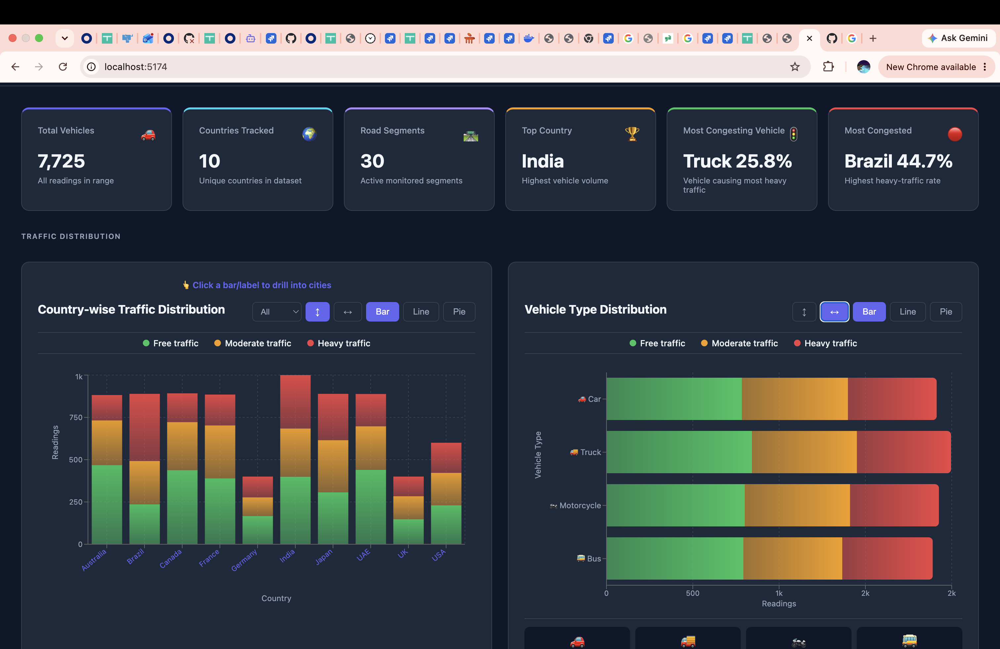
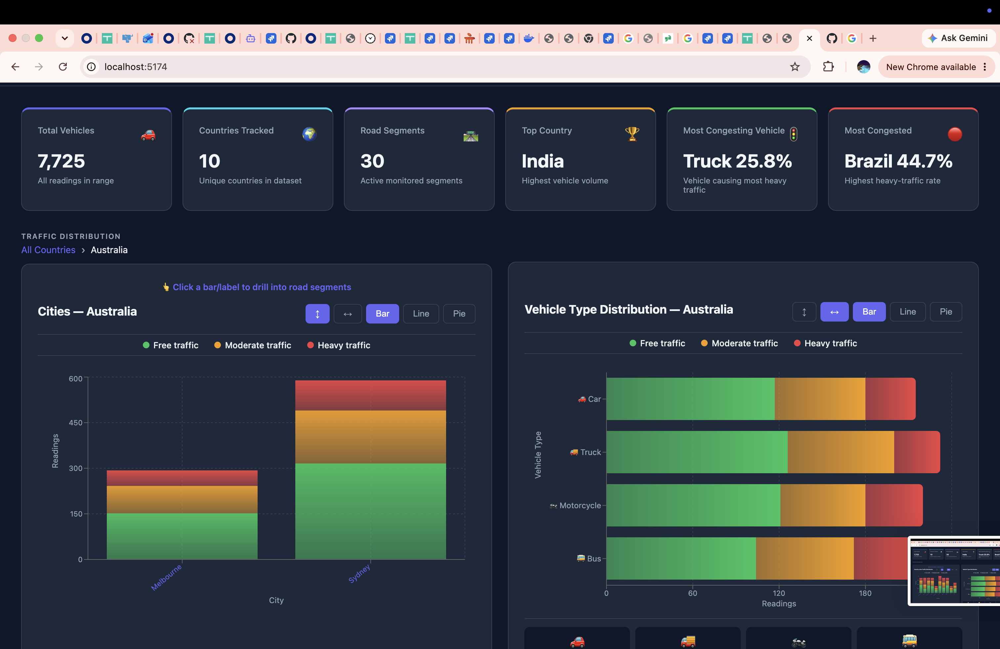
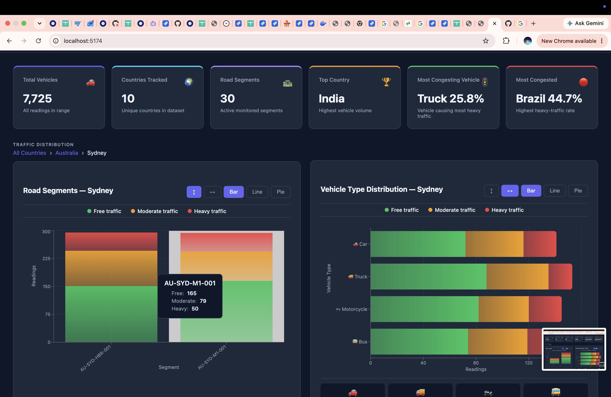
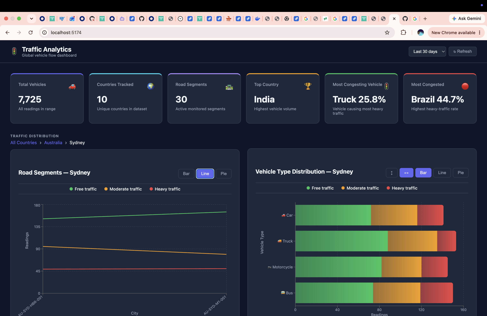
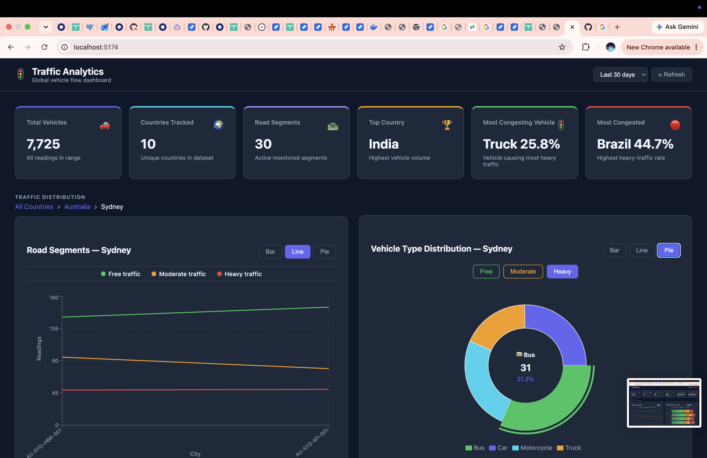
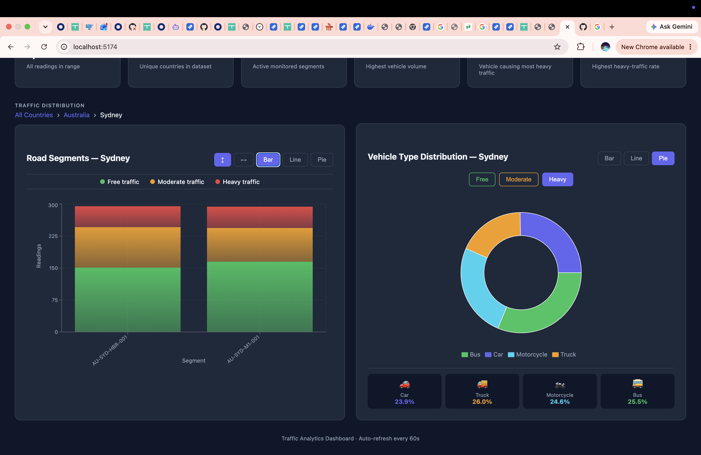

# Traffic Data App

A traffic analytics dashboard — interactive drill-down charts and live summary tiles.
---

## Quick Start

Only requirement: **Docker**

```bash
git clone https://github.com/shreshtha235/traffic_data_app.git
cd traffic_data_app
cp .env.example .env
docker compose up --build
```

Seed sample data (run once after containers are up):

```bash
docker compose exec backend npx ts-node scripts/seed.ts
```

App → `http://localhost`

---

## Tech Stack

| Layer | Technology |
|---|---|
| Backend | NestJS 10, TypeORM 0.3, class-validator |
| Frontend | React 19, Vite 8, Recharts 3 |
| Database | PostgreSQL 16 |
| Container | Docker, docker-compose |
| Testing | Jest 29 + ts-jest (backend), Vitest + @testing-library/react (frontend) |

---

## Running Locally

### Prerequisites

- Node.js 20+
- PostgreSQL 16 running locally

### 1. Database

```bash
psql -U postgres -c "CREATE DATABASE traffic_data;"
psql -U postgres -d traffic_data -f backend/migrations/001_init.sql
```

### 2. Backend

```bash
cd backend
cp ../.env.example .env
# Edit .env — set DB_HOST=localhost and your DB credentials
npm install
npm run start:dev
# API available at http://localhost:3001/api
```

### 3. Seed data

```bash
cd backend
npx ts-node scripts/seed.ts
# Creates 30 road segments and 9,000 telemetry readings
```

### 4. Frontend

```bash
cd frontend
npm install
npm run dev
# App available at http://localhost:5174
```

---

## Running with Docker

```bash
cp .env.example .env
docker compose up --build
# App → http://localhost
# API → http://localhost/api
```

Seed data inside Docker:

```bash
docker compose exec backend npx ts-node scripts/seed.ts
```

---

## Running Tests

```bash
# Backend — 28 tests
cd backend && npm test

# Frontend — 5 tests
cd frontend && npm test
```

---

## Screenshots

**Dashboard overview — KPI row + country & vehicle charts**


**Drill-down Level 2 — Cities within Australia**


**Drill-down Level 3 — Road segments within Sydney (with tooltip)**


**Line chart view at segment level**


**Mixed chart types — Line (left) + Pie (right)**


**Bar + Pie with vehicle % breakdown footer**


---

## Documentation

See [SYSTEM_ARCHITECTURE.md](./SYSTEM_ARCHITECTURE.md) for HLD, API reference and data flow.

See [DESIGN_DOC.md](./DESIGN_DOC.md) for detailed design decisions