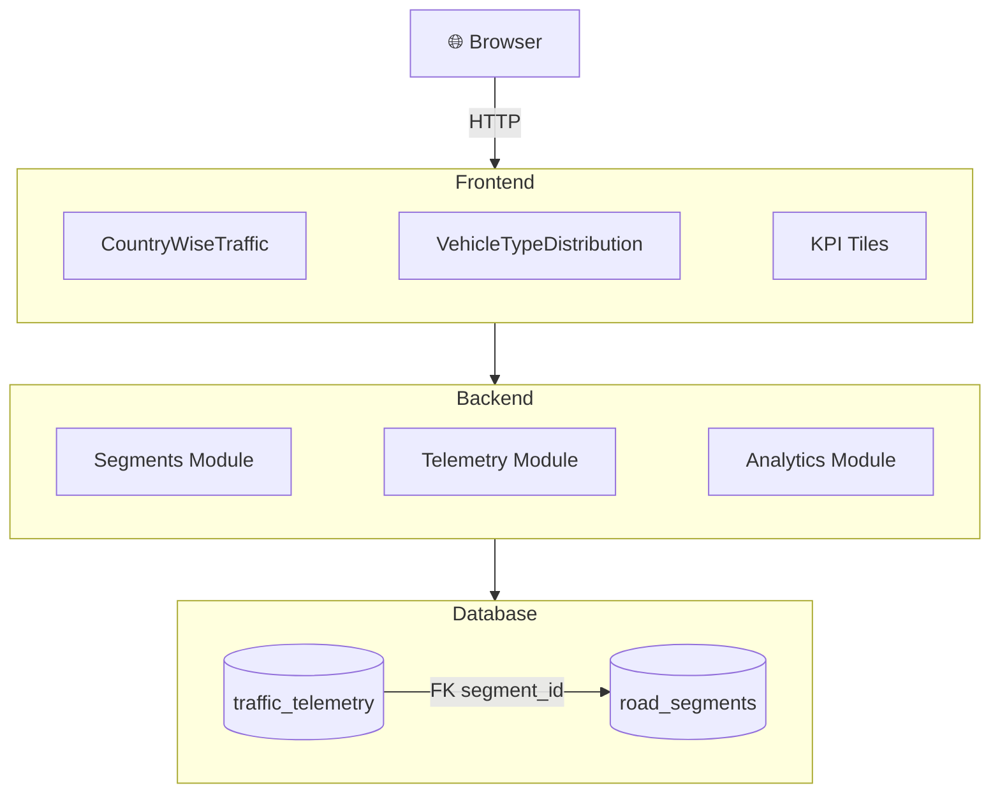
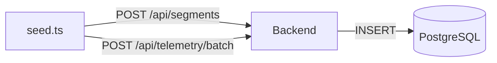
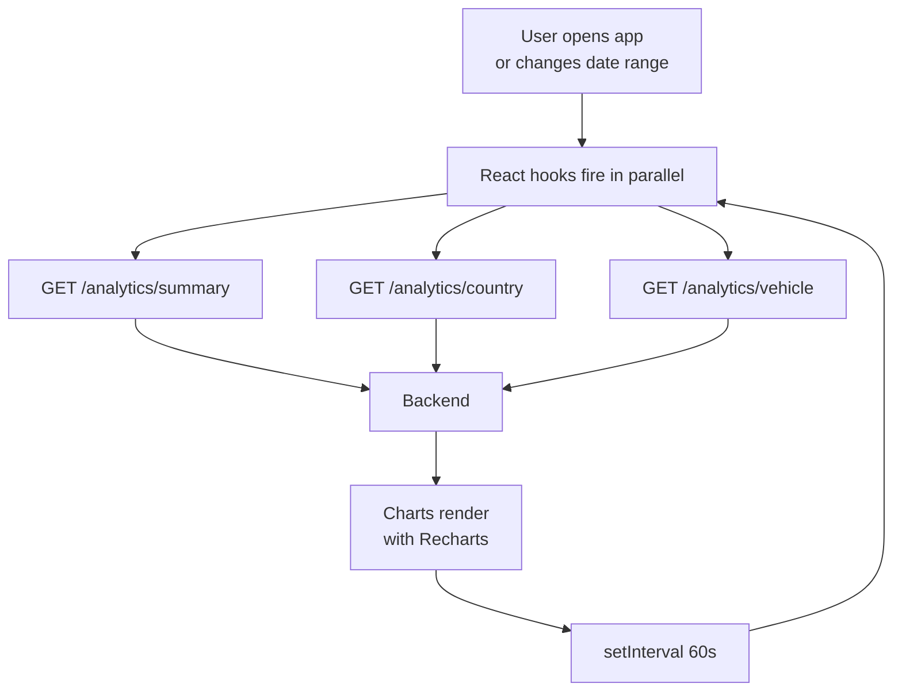
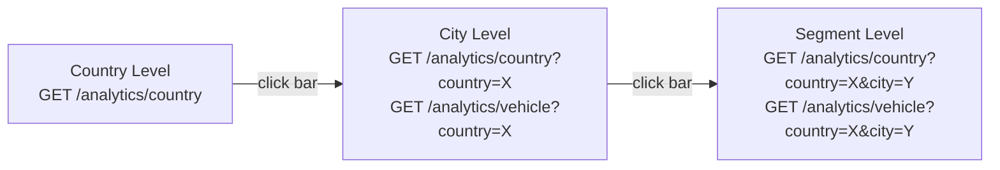

# System Architecture

## Table of Contents

1. [High-Level Architecture](#high-level-architecture)
2. [Data Model](#data-model)
3. [Data Flow](#data-flow)
4. [API Reference](#api-reference)
5. [Frontend Architecture](#frontend-architecture)
6. [Data Update Strategy](#data-update-strategy)

---

## High-Level Architecture



### Docker network

```
docker-compose network
  postgres   :5432  (internal only)
  backend    :3001  (exposed to host for direct API access)
  frontend   :80    (exposed to host, nginx proxies /api → backend)
```

---

## Data Model

### road_segments

| Column | Type |
|---|---|
| id(PK) | uuid |
| segment_code | varchar(100) | 
| country | varchar(100) | 
| city | varchar(100) | 
| road_name | varchar(200) | 
| speed_limit_kmph | decimal(5,2) | 
| start_lat / start_lng | decimal(10,6) | 
| end_lat / end_lng | decimal(10,6) | 
| created_at | timestamptz |

### traffic_telemetry

| Column | Type | Notes |
|---|---|---|
| id | uuid | Primary key |
| segment_id | uuid | FK → road_segments.id (CASCADE DELETE) |
| vehicle_type | enum | `car` · `truck` · `motorcycle` · `bus` |
| speed_kmph | decimal(5,2) | Observed speed |
| vehicle_count | int | Vehicles in this reading |
| recorded_at | timestamptz | Indexed together with segment_id |
| created_at | timestamptz | Auto |

### Congestion classification

Each reading is classified at query time by comparing `speed_kmph` to `speed_limit_kmph`:

| Status | Condition |
|---|---|
| **Free** | `speed / limit ≥ 0.70` |
| **Moderate** | `0.40 ≤ speed / limit < 0.70` |
| **Heavy** | `speed / limit < 0.40` |

---

## Data Flow

### Seeding



### Dashboard query cycle



### Drill-down flow



---

## API Reference

Base URL: `http://localhost:3001/api`

### Analytics (UI APIs)

| Method | Endpoint | Query Params | Description |
|---|---|---|---|
| `GET` | `/analytics/summary` | `from`, `to` | KPI tile data |
| `GET` | `/analytics/country` | `from`, `to`, `country?`, `city?` | Distribution grouped by country / city / segment |
| `GET` | `/analytics/vehicle` | `from`, `to`, `country?`, `city?` | Distribution grouped by vehicle type |

**GET /analytics/summary response**

```json
{
  "total_vehicles": 9000,
  "total_countries": 10,
  "total_segments": 30,
  "top_country": "Germany",
  "dominant_type": "Truck",
  "dominant_type_pct": "45.2",
  "most_congested": "India",
  "most_congested_pct": "38.1"
}
```

**GET /analytics/country response**

```json
[
  {
    "label": "Germany",
    "free_count": "1200",
    "moderate_count": "480",
    "heavy_count": "320",
    "total_count": "2000"
  }
]
```
---

### Segments (DB Table CRUD APIs)

| Method | Endpoint |
|---|---|
| `POST` | `/segments` | 
| `GET` | `/segments` | 
| `GET` | `/segments/:id` | 
| `PUT` | `/segments/:id` | 
| `PATCH` | `/segments/:id` | 
| `DELETE` | `/segments/:id` | 

**POST /segments request body**

```json
{
  "segment_code": "US-NYC-001",
  "country": "United States",
  "city": "New York",
  "road_name": "5th Avenue",
  "speed_limit_kmph": 50,
  "start_lat": 40.748817,
  "start_lng": -73.985428,
  "end_lat": 40.752726,
  "end_lng": -73.977229
}
```

---

### Telemetry (DB Table CRUD APIs)

| Method | Endpoint | 
|---|---|
| `POST` | `/telemetry/batch` | 
| `PATCH` | `/telemetry/:id` | 
| `DELETE` | `/telemetry/:id` | 

`segment_id` and `vehicle_type` are immutable after creation.

**POST /telemetry/batch request body**

```json
{
  "readings": [
    {
      "segment_id": "550e8400-e29b-41d4-a716-446655440000",
      "vehicle_type": "truck",
      "speed_kmph": 28.5,
      "vehicle_count": 3,
      "recorded_at": "2024-01-15T08:30:00.000Z"
    }
  ]
}
```

---


## Frontend Architecture

```
src/
├── App.tsx              
├── types.ts             
├── hooks/
│   ├── useAnalytics.ts        
│   ├── useSummary.ts          
│   └── useVehicleAnalytics.ts 
└── components/
    ├── CountryChart.tsx   
    └── VehicleChart.tsx  
```


## Data Update Strategy

 `POST /telemetry/batch` or `PATCH /telemetry/:id` APIs. FE refreshes after every 60s.
 
Caching can be done for faster reads based on scale.

For real-time push at higher scale: SSE or WebSocket, Polling FE
---

## Scalability Plan

### Write side (data ingestion)

| Scale | Approach |
|---|---|
| 5 RPS | REST POST `/api/telemetry/batch` direct to PostgreSQL|
| 50 RPS | Same REST endpoint. Connection Pool increase. DB Indexing |
| 500 RPS | Kafka ingestion, batch DB writes |

**Kafka architecture at 500 RPS:**
```
Sensors → Kafka → NestJS consumer → DB (write)
                                                           ↘ DB replica (read)
```


### Read side (dashboard delivery)

| Scale | Approach |
|---|---|
| 5 RPS | REST polling ,  In-memory cache |
| 50 RPS | **SSE** replaces polling.**Redis** |
| 500 RPS | **SSE + Redis + pub/sub** PostgreSQL read replica|

**Full 500 RPS architecture:**
```
                      ┌──────────────┐
Sensors ──▶ Kafka ──▶ │ NestJS       │──▶ DB Primary (writes)
                      │ Consumer     │
                      └──────────────┘
                                         DB Replica (reads)
                                              ▲
Load Balancer                                 │
     │                                        │
     ├──▶ NestJS Instance 1 ──────────────────┤
     ├──▶ NestJS Instance 2 ──────────────────┤
     └──▶ NestJS Instance 3 ──────────────────┘
               │         │
               └────┬────┘
                  Redis
              (cache + SSE pub/sub)
```

---
